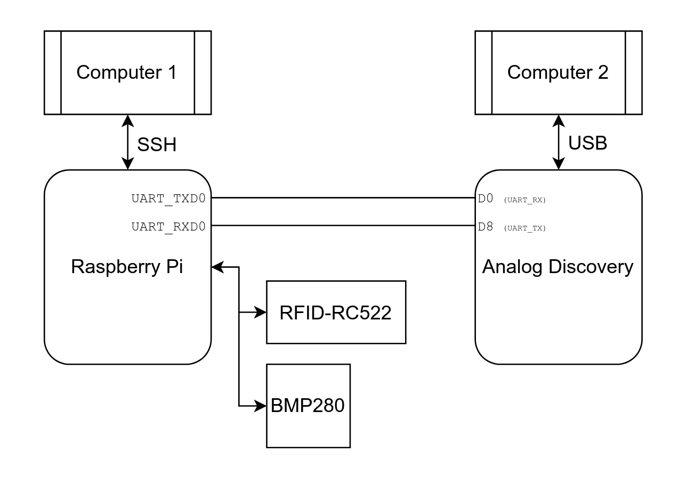
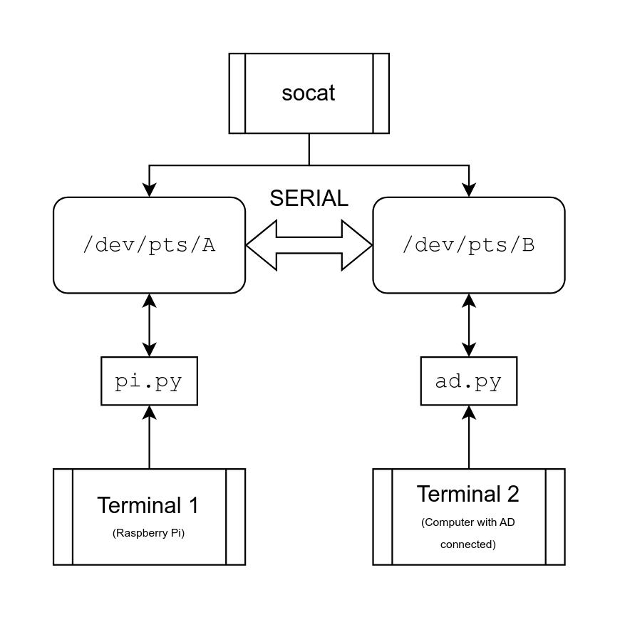

# Raspberry Pi - Analog Discovery playground
A collection of Python scripts I made for playing around with a Raspberry Pi and an Analog Discovery 2 board.

## Setup
For the `live` branch:

For the `sim` branch:

## Requirements
1. `sim` branch (Linux only):
- [tkinter](https://docs.python.org/3/library/tkinter.html) (make sure it is installed with your Python distribution)
- [socat](http://www.dest-unreach.org/socat/) (install using your package manager)
- [pyserial](https://pypi.org/project/pyserial/)
- [numpy](https://pypi.org/project/numpy/)
2. `live` branch (Windows only :P):
- [Digilent WaveForms](https://digilent.com/shop/out-of-the-box-solutions/) (f**k Digilent)
- [pydwf](https://pypi.org/project/pydyf/) (f**k Digilent)
- On your Raspberry Pi:
    * [pyserial](https://pypi.org/project/pyserial/)
    * [mfrc522](https://pypi.org/project/mfrc522/)
    * [bmp280](https://pypi.org/project/bmp280/)

# `sim` and `live` branches
In case you don't have access to the hardware, but you want to simulate it working using two terminals (I know, it's less fun), use the `sim` branch. The live branch contains the same logic, but imports the necessary libraries.

# Contents

Every subdirectory contains:
- a separate `README.md` with detailed description of the example
- `pi.py` - the script which runs on the Raspberry Pi (or the emulating terminal)
- `ad.py` - the script which runs on the computer connected to the Analog Discovery 2
